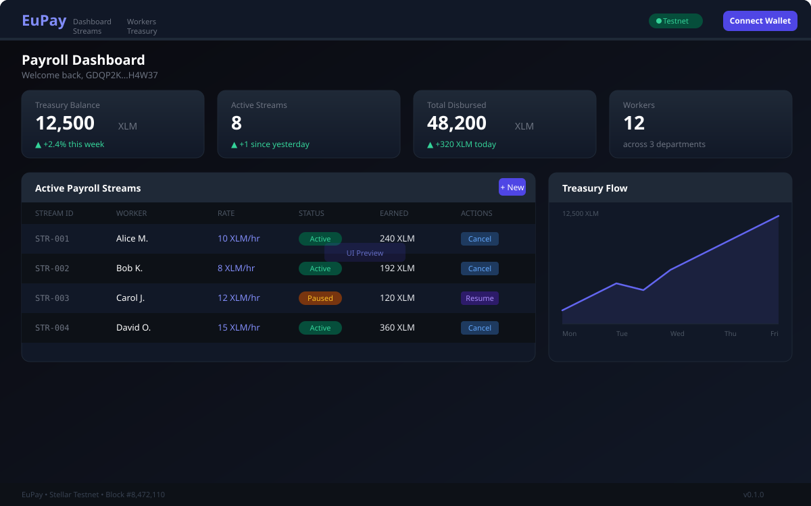

# EuPay Frontend

<div align="center">


**Payroll Streaming Dashboard — Built on Stellar**

[](LICENSE)
[](https://stellar.org)
[](https://soroban.stellar.org)
[](https://freighter.app)

[Features](#-features) • [Quick Start](#-quick-start) • [Architecture](#-architecture) • [Contributing](#-contributing)

</div>

---

## 📖 Overview

EuPay Frontend is the web dashboard for the EuPay payroll streaming protocol on Stellar. It gives employers and workers a real-time interface to manage continuous salary streams, treasury balances, and payment history — all powered by Soroban smart contracts.

### Why EuPay?

- **⚡ Real-Time** — Workers see earnings accrue per second, not per month
- **🌍 Borderless** — Pay anyone anywhere in XLM, USDC, or any Stellar asset
- **🔒 Non-Custodial** — Funds remain on-chain; no intermediary holds your money
- **📊 Transparent** — Every transaction is verifiable on the Stellar blockchain


## 📸 Screenshots



---
## ✨ Features

### For Employers
- Create and manage continuous payroll streams
- Fund treasury vault with any Stellar asset
- Cancel streams with automated prorated final payouts
- Dashboard analytics for payroll spend and workforce overview

### For Workers
- Real-time earnings display — watch your balance grow every second
- Claim earned salary anytime with one click
- View full stream history and timeline
- Multi-stream support for multiple income sources

---

## 🏗️ Architecture

```
┌─────────────────────────────────────────────┐
│         EuPay Frontend (Vite + React)       │
│   • Freighter Wallet Integration            │
│   • Real-time Earnings Calculator           │
│   • Stream Management Dashboard            │
│   • Treasury Analytics                     │
└──────────────────┬──────────────────────────┘
                   │ Soroban RPC
┌──────────────────▼──────────────────────────┐
│      EuPay Smart Contracts (Soroban)        │
│   • PayrollStream                          │
│   • TreasuryVault                          │
└─────────────────────────────────────────────┘
```

### Technology Stack

| Layer | Technology |
|-------|-----------|
| Framework | Vite + React 18 + TypeScript |
| Wallet | Freighter (Stellar) |
| Blockchain | Stellar / Soroban RPC |
| Styling | Tailwind CSS |
| State | TanStack Query |
| Icons | Lucide React |

---

## 🚀 Quick Start

### Prerequisites

- Node.js 20+
- [Freighter Wallet](https://freighter.app) browser extension
- A Stellar testnet account (use [Friendbot](https://friendbot.stellar.org))

### Installation

```bash
# Clone the repository
git clone https://github.com/EuStellar-Pay/EuPay-frontend.git
cd EuPay-frontend

# Install dependencies
npm install

# Configure environment
cp .env.example .env
# Edit .env with your contract addresses

# Start development server
npm run dev
```

The app will be available at **http://localhost:5173**

### Environment Variables

```env
VITE_STELLAR_NETWORK=TESTNET
VITE_SOROBAN_RPC_URL=https://soroban-testnet.stellar.org
VITE_CONTRACT_PAYROLL_STREAM=<your-contract-id>
VITE_CONTRACT_TREASURY_VAULT=<your-contract-id>
```

---

## 📁 Project Structure

```
src/
├── components/
│   ├── ConnectWallet.tsx     # Freighter wallet connection
│   ├── Dashboard.tsx         # Main dashboard layout
│   ├── StreamList.tsx        # Active payroll streams table
│   └── TreasuryCard.tsx      # Treasury balance card
├── hooks/
│   └── useStream.ts          # Stream data fetching hook
└── App.tsx                   # Application root
```

---

## 🤝 Contributing

Contributions are welcome! Please read our [Contributing Guide](../CONTRIBUTING.md) and open a pull request.

---

## 📜 License

Apache 2.0 — see [LICENSE](LICENSE)

---

## 👥 Past Contributors

| GitHub | Role |
|--------|------|
| [@Uchechukwu-Ekezie](https://github.com/Uchechukwu-Ekezie) | Past Contributor |
| [@bakarezainab](https://github.com/bakarezainab) | Past Contributor |
| [@Gbangbolaoluwagbemiga](https://github.com/Gbangbolaoluwagbemiga) | Past Contributor |
| [@Wilfred007](https://github.com/Wilfred007) | Past Contributor |
| [@meshackyaro](https://github.com/meshackyaro) | Past Contributor |
| [@ogazboiz](https://github.com/ogazboiz) | Past Contributor |
| [@Godbrand0](https://github.com/Godbrand0) | Past Contributor |
| [@Christopherdominic](https://github.com/Christopherdominic) | Past Contributor |
| [@Olowodarey](https://github.com/Olowodarey) | Past Contributor |
| [@emdevelopa](https://github.com/emdevelopa) | Past Contributor |
| [@pope-h](https://github.com/pope-h) | Past Contributor |
| [@DeborahOlaboye](https://github.com/DeborahOlaboye) | Past Contributor |
| [@Rampop01](https://github.com/Rampop01) | Past Contributor |
| [@LaGodxy](https://github.com/LaGodxy) | Past Contributor |
| [@AbelOsaretin](https://github.com/AbelOsaretin) | Past Contributor |
| [@7maylord](https://github.com/7maylord) | Past Contributor |
| [@Jayy4rl](https://github.com/Jayy4rl) | Past Contributor |
| [@CMI-James](https://github.com/CMI-James) | Past Contributor |
| [@edehvictor](https://github.com/edehvictor) | Past Contributor |

<div align="center">

**Built with ❤️ on Stellar**

[EuStellar-Pay Organization](https://github.com/EuStellar-Pay) • [Backend](https://github.com/EuStellar-Pay/EuPay-backend) • [Mobile](https://github.com/EuStellar-Pay/EuPay-mobile) • [Smart Contracts](https://github.com/EuStellar-Pay/EuPay-smartcontract)

</div>
